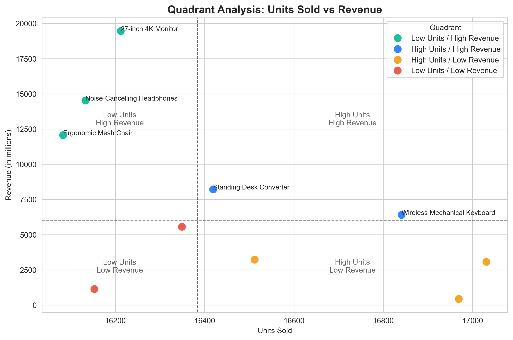
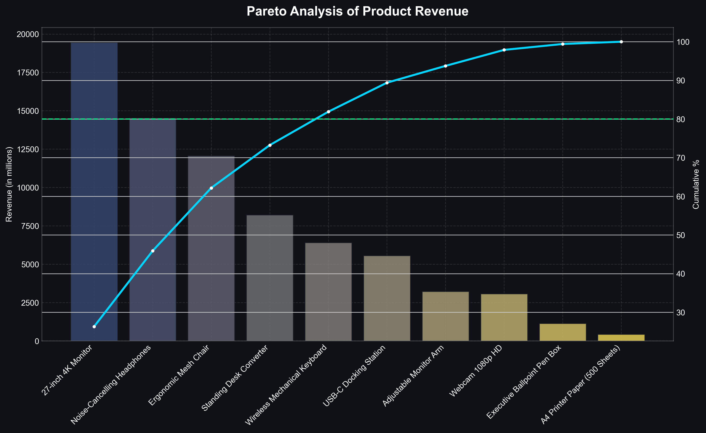
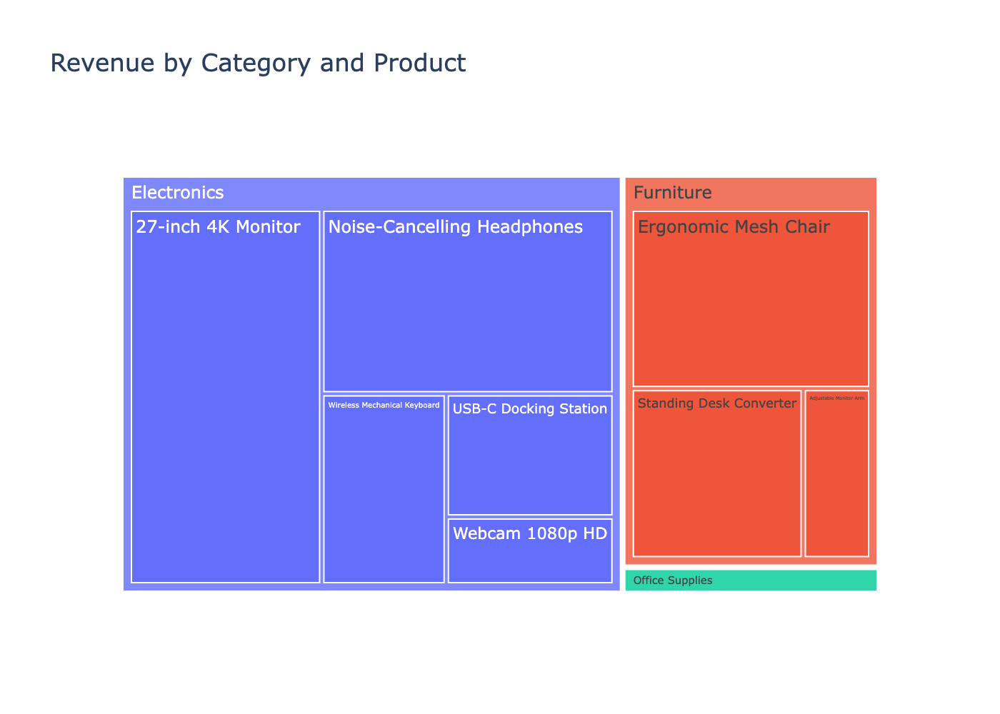

#  Product Portfolio Analytics (Retail Transactions)
---

##  Overview

This project analyzes retail transaction data to understand product performance, revenue distribution, and portfolio structure.

The focus is on identifying high-value products, revenue concentration patterns, and product roles using exploratory data analysis techniques.

---

##  Dataset

The dataset includes transaction-level retail data with the following fields:

- Transaction ID  
- Date  
- Product ID  
- Product Name  
- Product Category  
- Quantity  
- Price Per Unit  
- Amount (Revenue)

---

##  Objectives

- Identify top-performing products and categories  
- Understand revenue distribution across products  
- Apply Pareto analysis (80/20 rule)  
- Segment products based on revenue vs volume behavior  
- Visualize category contribution and portfolio structure  

---

##  1. Product Performance Analysis

Products were evaluated based on total revenue and units sold.

Key findings:
- Revenue is highly concentrated among a small number of products  
- Significant variation exists between high-volume and high-value products  

---

##  2. Product Segmentation (Revenue vs Volume)

Products were segmented into four quadrants:

###  Premium Products (High Revenue, Low Volume)
- Ergonomic Mesh Chair  
- Noise Cancelling Headphones  
- 27-inch 4K Monitor  

###  Star Products (High Revenue, High Volume)
- Standing Desk Converter  
- Wireless Mechanical Keyboard  

###  Volume Drivers (Low Revenue, High Volume)
- Adjustable Monitor Arm  
- Webcam 1080p HD  
- A4 Printer Paper  

###  Underperformers (Low Revenue, Low Volume)
- Executive Ballpoint Pen Box  
- USB-C Docking Station  

---

## Quadrant Visualization



---

##  3. Pareto Analysis (80/20 Rule)

A Pareto analysis was conducted to measure revenue concentration across products.

### Key insight:
Approximately 80% of total revenue is generated by a small subset of products.

This indicates a strong dependency on a limited number of high-performing SKUs.

### Business implications:
- Core products should be prioritized for inventory and marketing  
- Long-tail products contribute marginal revenue  
- Business performance is highly sensitive to top product performance  

---

##  Pareto Visualization



---

## 4. Product Category Treemap

A treemap visualization was used to analyze category-level revenue distribution.

### Key insight:
- Revenue is unevenly distributed across categories  
- Certain categories dominate overall sales performance  
- Clear hierarchy exists in product contribution  

---

##  Category Treemap Visualization



---

##  Key Takeaways

- Revenue follows a strong Pareto distribution (80/20 rule)  
- Products can be clearly grouped into strategic business roles  
- A small number of SKUs drive the majority of revenue  
- Category imbalance suggests optimization opportunities  

---

##  Tools Used

- Python  
- Pandas  
- Matplotlib  
- Seaborn  
- Plotly  

---

##  Project Structure

```text
.
├── data/
│ └── raw_rfm_sales_transactions_30000.csv
├── notebooks/
│ └── eda.ipynb
├── charts/
│ ├── category_tree.png
│ ├── Pareto_Analysis.png
│ └── Quadrant_Analysis.png
└── README.md
